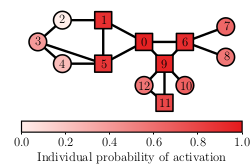

# Exact analytical solution of irreversible binary dynamics on networks [](https://travis-ci.com/laurencee9/exact_binary_dynamics)





A python implementation of the exact solution of irreversible binary dynamics on networks.

## Table of content

1. [Usage](#usage)
	1. [Solver](#solver)
	2. [Parameters](#parameters)
2. [Companion article](#companion-article)


## Usage

### Solver

After having declared your parameters, you must initiate an instance and run the algorithm:

	solver = Solver(params)
	Q = solver.get_probabilities_Q()

The output of `solver.get_probabilities_Q()` is a dictionary where keys are the configurations as strings (e.g. "101011011") and values are the probabilities of getting the key configuration. For example, the output could look like:

```
{
 '01110': -3.5575383784680611984e-21,
 '01111': 1.8973538018496326391e-20,
 '11001': -5.4887734982078661633e-20,
	...
 }
```

### Parameters

The algorithm needs some parameters to run. We use a dictionary to feed the parameters. 
```
params = {
 "edgelist_path" : "./edgelist.txt",
	"response_function": [
		{	
			"name": "bond",
			"nodes": [0,1,2],
			"params": {
				"p": 0.3,
				"p_spontaneous": 0.1
			}
		},
		{	
			"name": "watts",
			"nodes": [3,4],
			"params": {
				"threshold": 3.0,
				"p": 0.4
			}
		},
	]
}
```

 - `edgelist_path` : The path to the edgelist
 - `response_function` : A list of response functions to use.

In each element of `params["response_function"]`, you must declare the name of the response function and the nodes that apply to. 


## Symbolic results

It is possible to output the result in a symbolic form. In this case, you do not need to specify the response functions

```python
params = {
	"edgelist_path" : "./edgelist.txt",
	"symbolic"      : True
}
solver = Solver(params)
Q = solver.get_probabilities_Q()
```
The output will look like


```json
'00001' : '<prod><add>1;-<div><prod>G(0,0);G(1,0);G(2,0);G(3,0);G(4,0)</prod>;<prod>G(0,0);G(1,0);G(2,0.0);G(3,0.0);</prod></div>;</add>;<prod>G(0,0);G(1,1);G(2,0.0);G(3,0.0);</prod></prod>',
'00000' : '<prod>G(0,0);G(1,0);G(2,0);G(3,0);G(4,0)</prod>',
'00100' : '<prod><add>1;-<div><prod>G(0,0);G(1,0);G(2,0);G(3,0);G(4,0)</prod>;<prod>G(0,0);G(1,0);G(3,0.0);G(4,0.0);</prod></div>;</add>;<prod>G(0,0);G(1,1);G(3,0.0);G(4,0.0);</prod></prod>',
...
```
The symbolic form can be interpreted like a HTML code. Use `BeautifulSoup` to prettify the output. 

```python
import numpy as np
from bs4 import BeautifulSoup

symbols = "<prod><add>1;-<div><prod>G(0,0);G(1,0);G(2,0);G(3,0);G(4,0)</prod>;<prod>G(0,0);G(1,0);G(2,0.0);G(3,0.0);</prod></div>;</add>;<prod>G(0,0);G(1,1);G(2,0.0);G(3,0.0);</prod></prod>"
soup = BeautifulSoup(symbols, 'html.parser')
soup.prettify()
```

```xml
<prod>
 <add>
  1;-
  <div>
   <prod>
    G(0,0);G(1,0);G(2,0);G(3,0);G(4,0)
   </prod>
   ;
   <prod>
    G(0,0);G(1,0);G(2,0.0);G(3,0.0);
   </prod>
  </div>
  ;
 </add>
 ;
 <prod>
  G(0,0);G(1,1);G(2,0.0);G(3,0.0);
 </prod>
</prod>
```

The XML format has three tags 

 * `<prod>` : Product
 * `<add>` : Addition
 * `<div>` : Division
 * `G(i,m)` : Means `1-F_i(m)` where `i` is the node index and `m` is the number of active neighbors

where contents are separated by `;`.

For example, 

 * `<prod>G(0,1);G(1,3)</prod>` means `G(0,1)*G(1,3)`
 * `<add>G(0,1);G(1,3)</add>` means `G(0,1)+G(1,3)`
 * `<div>G(0,1);G(1,3)</div>` means `G(0,1)/G(1,3)`

And more complex statements should keep the hierarchy, such as

 * `<prod><add>1;G(0,1)</add>;G(2,2)</prod>` means `[1-G(0,1)]*G(2,2)`

## Publications

Please cite:

"*Exact analytical solution of irreversible binary dynamics on networks*"<br/>
[E. Laurence](http://edwardlaurence.me/), [J.-G. Young](http://jgyoung.ca), [S. Melnik](https://scholar.google.com/citations?user=uF3-t9EAAAAJ), and [L. J. Dubé](https://www.dynamica.phy.ulaval.ca/index.php?id=contact)<br/>
Phys. Rev. E. **97**, 032302 (2008)<br/>
DOI: [10.1103/PhysRevE.97.032302](https://doi.org/10.1103/PhysRevE.97.032302)

Read it on: [arXiv](https://arxiv.org/abs/1711.02721)
